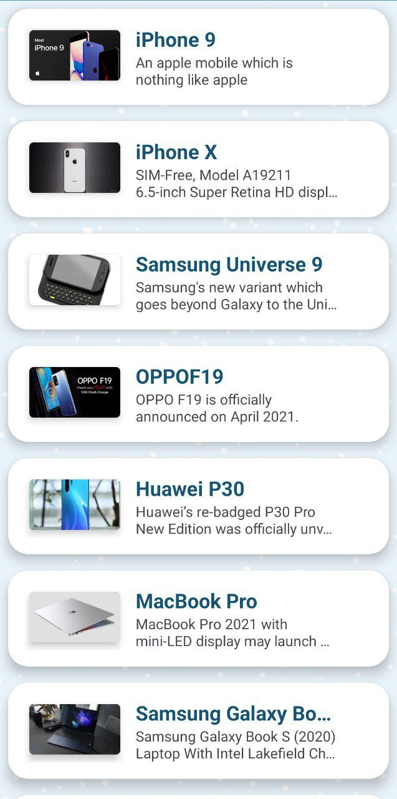
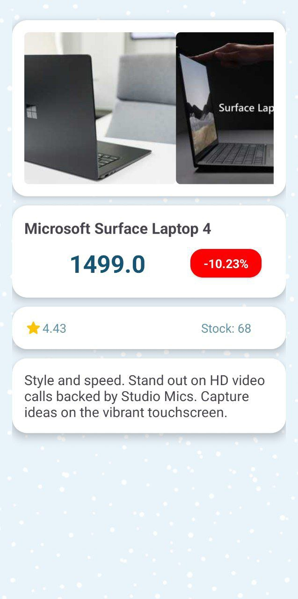

# DummyGoodsApp

## About
The application was created as part of a test assignment.
The application is a list of products received via the [DummyJson]("http://dummyjson.com/products"). Clicking on an item in the list takes you to the product information screen.

The following functionality and components have been implemented:
 - UI via Android View
 - Asyncronous operations using Coroutines
 - Networking operations using java.net.URLConnection
 - Koin for DI

## Screenshots

